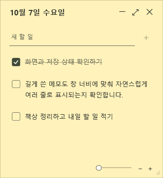
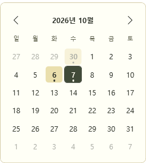

# 하루 메모 · Haru Memo

화면에 붙여 두는 작은 Windows 투두 메모장입니다. 기본 화면에는 날짜, 새 할 일 입력, 체크리스트만 표시되고, 설정과 기록은 확장 아이콘으로 열 수 있습니다.



## 다운로드 및 실행

1. [최신 릴리스](https://github.com/dpfla8628/haru-memo/releases/latest)에서 `HaruMemo-Windows.zip`을 내려받습니다.
2. 쓰기 가능한 폴더에 압축을 풀고 `HaruMemo.exe`를 실행합니다.

Windows 10/11, .NET Framework 4.8 환경을 대상으로 합니다. 설치 프로그램, 계정, 인터넷 연결 없이 사용할 수 있습니다. 실행 파일은 코드 서명되어 있지 않습니다.

## 사용하기

- 할 일을 입력하고 Enter 또는 +로 추가합니다. 완료한 항목은 취소선으로 남습니다.
- 날짜별로 목록을 관리하고, 확장 화면에서 전체 기록·완료·미완료 항목을 검색하거나 날짜 범위로 조회합니다.
- 날짜 선택 달력에서 기록이 있는 날은 메모 색상 배경과 작은 점으로 표시됩니다. 완료한 기록도 포함되며, 추가·삭제·날짜 수정 시 자동으로 갱신됩니다.
- 메모를 이동하거나 크기를 조절하고, 다섯 가지 색상과 항상 위에 고정을 선택할 수 있습니다.
- **− 버튼**은 메모를 화면 오른쪽의 작은 인덱스 탭으로 접습니다. 탭을 클릭하면 기존 위치와 크기로 다시 열립니다. 탭은 위아래로 이동할 수 있습니다.
- 일반 작업 표시줄 최소화는 **Ctrl+M** 또는 확장 화면의 **··· 메뉴**에서 사용할 수 있습니다.
- 작업 내용을 클릭하면 수정할 수 있습니다. 오른쪽 클릭 메뉴에서 삭제하면 되돌리기 알림이 7초 동안 표시됩니다.
- 현재 목록 또는 전체 기록을 CSV로 내보내거나 JSON으로 백업할 수 있습니다.




전체 기능과 단축키는 [사용방법.md](사용방법.md)를 참고하세요. 스크린샷의 항목은 테스트용 예시입니다.

## 데이터 저장

실행 파일 옆 `data/notes.json`에 메모와 설정이 저장됩니다. 이전 저장 내용은 `notes.json.bak`으로 보관합니다. 앱을 옮길 때는 `data` 폴더도 함께 옮겨 주세요.

저장소와 배포 파일에는 개인 메모 데이터가 포함되어 있지 않습니다. 앱에는 서버로 데이터를 보내는 기능이 없습니다.

## 소스에서 빌드

Windows PowerShell에서 저장소 폴더를 열고 실행합니다.

```powershell
powershell -NoProfile -ExecutionPolicy Bypass -File .\build.ps1
.\HaruMemo.exe
```

Windows에 포함된 .NET Framework C# 컴파일러와 WPF를 사용합니다. 별도의 NuGet 패키지는 필요하지 않습니다.

| 파일 | 역할 |
| --- | --- |
| `StickyTodo.cs` | 앱 동작, 데이터 저장, 인덱스 탭, 자체 검증 |
| `Main.xaml` | 메모 화면과 컨트롤 스타일 |
| `build.ps1` | 아이콘 생성 및 실행 파일 빌드 |
| `app.manifest` | DPI 설정과 실행 권한 |

## 검증

독립된 임시 폴더를 지정하여 데이터 검증과 UI 검증을 실행할 수 있습니다. UI 검증은 테스트 창을 열고 지정한 폴더에 결과와 스크린샷을 남깁니다.

```powershell
Start-Process .\HaruMemo.exe -ArgumentList '--self-test', "$env:TEMP\HaruMemo-data-check" -Wait
Start-Process .\HaruMemo.exe -ArgumentList '--ui-test', "$env:TEMP\HaruMemo-ui-check" -Wait
```

날짜별 저장, 완료 상태 보존, 검색·필터, 백업 복구, 내보내기, 확장·접기, 고정·크기 조절, 달력, 삭제 되돌리기, 인덱스 탭 복원, 작업 표시줄 최소화 동작을 확인했습니다.
